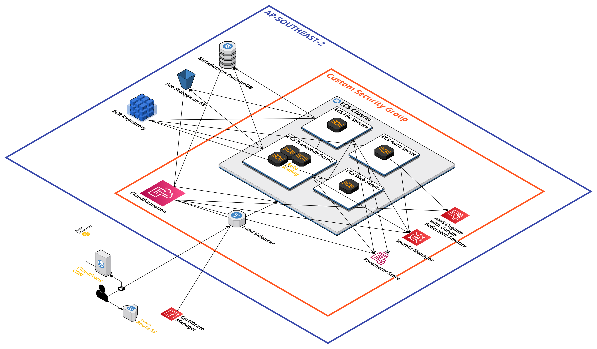

# Application overview

This is an **Online Video Transcoding System** that allows users to upload their videos, preview the videos, and transcode them into different formats and qualities. The system contains four services which are secure user authentication service, file storage and management service, video transcoding service, and web application service. These services are all deployed on AWS ECS as microservices to ensure scalability and flexibility.

# Application architecture

* S3: used to store user uploaded and transcoded video files efficiently
* DynamoDB: used to store metadata related to uploaded and transcoded files
* Secrets Manager: used to manage sensitive information securely including credentials
* Parameter Store: used to store application parameters including database names and api paths
* CloudFormation: used to deploy and provision all AWS services involved in the application (Infrastructure as Code)
* Elastic Container Registry (ECR): used to store container images of microservices
* Load Balancer: used to route requests to the appropriate backend service using path-based routing and manage HTTPS termination
* Certificate Manager: used to manage and renew HTTPS certificate
* Route 53: used to manage DNS record for the application
* CloudFront: used to cache static files and pages of the application
* Cognito: used to manage user information and provide authenticaiton and federated identities
* Elastic Container Service (ECS): used to orchestra microservices with containers and enable auto scaling

## Project Core - Microservices
- **First service functionality:** Auth Service (handles user authentication)
- **First service compute:** 
  - ECS
  - Name: n11670339-a3-auth-service
  - ARN: arn:aws:ecs:ap-southeast-2:901444280953:service/n11670339-assessment3/n11670339-a3-auth-service
  - Task ID: bc3b9058bc294b309636e710d376909f
- **First service source files:**
  - /auth-service
- **Second service functionality:** File Service (manages file uploads and metadata)
- **Second service compute:**
  - ECS
  - Name: n11670339-a3-file-service
  - ARN: arn:aws:ecs:ap-southeast-2:901444280953:service/n11670339-assessment3/n11670339-a3-file-service
  - Task ID: 6ed3765311274924b2b38634b8054596
- **Second service source files:**
  - /file-service
- **Video timestamp:** 00:04

## Project Additional - Additional microservices

- **Third service functionality:** Transcoding Service (handles video processing)
- **Third service compute:**
  - ECS
  - Name: n11670339-a3-transcode-service
  - ARN: arn:aws:ecs:ap-southeast-2:901444280953:service/n11670339-assessment3/n11670339-a3-transcode-service
  - Task ID: 44c342f714ed4ae1af1a05e29a9f60e6
- **Third service source files:**
  - /transcoding-service

- **Fourth service functionality:** Web Service (serves static files for the UI)
- **Fourth service compute:**
  - ECS
  - Name: n11670339-a3-web-service
  - ARN: arn:aws:ecs:ap-southeast-2:901444280953:service/n11670339-assessment3/n11670339-a3-web-service
  - Task ID: 91f91815eb714a30a30ab541d65363b2
- **Fourth service source files:**
  - /web-service

- **Video timestamp:** 00:28

## Project Additional - Serverless functions

- **Service(s) deployed on Lambda:**
- **Video timestamp:**
- **Relevant files:**

## Project Additional - Container orchestration with ECS 

- **ECS cluster name:** 
n11670339-assessment3
- **Task definition names:**   
  - n11670339-a3-auth
  - n11670339-a3-file
  - n11670339-a3-transcode
  - n11670339-a3-web
- **Video timestamp:** 00:09
- **Relevant files:**
    - /auth-service
    - /file-service
    - /transcoding-service
    - /web-service

## Project Core - Load distribution

- **Load distribution mechanism:** Application Load Balancer (ALB)
- **Mechanism instance name:** n11670339
- **Video timestamp:** 00:40
- **Relevant files:** N/A

## Project Additional - Communication mechanisms

- **Communication mechanism(s):** Routing via Application Load Balancer
- **Mechanism instance name:** n11670339
- **Video timestamp:** 01:11
- **Relevant files:**
  - /auth-service/routes/auth.js
  - /file-service/routes/file.js
  - /transcoding-service/routes/transcode.js

## Project Core - Autoscaling

- **ECS Service name:** n11670339-a3-transcode-service
- **Video timestamp:** 01:47
- **Relevant files:**
    - /transcoding-service

## Project Additional - Custom scaling metric

- **Description of metric:** [eg. age of oldest item in task queue]
- **Implementation:** [eg. custom cloudwatch metric with lambda]
- **Rationale:** [discuss both small and large scales]
- **Video timestamp:**
- **Relevant files:**

## Project Core - HTTPS

- **Domain name:** n11670339alb.cab432.com
- **Certificate ID:** 15bee52a-bdf1-42e9-985c-1f0206cb267b
- **ALB/API Gateway name:** n11670339
- **Video timestamp:** 00:49
- **Relevant files:** N/A

## Project Additional - Container orchestration features

- **First additional ECS feature:** service connect
- **Second additional ECS feature:** rolling update
- **Video timestamp:** 03:34
- **Relevant files:** N/A

## Project Additional - Infrastructure as Code

- **Technology used:** CloudFormation
- **Services deployed:** ECS, ALB
- **Video timestamp:** 04:38
- **Relevant files:**
    - /cloudformation.yaml
    - /cloudformation-ecs-cluster.yaml
    - /cloudformation-ecs-auth-service.yaml
    - /cloudformation-ecs-file-service.yaml
    - /cloudformation-ecs-web-service.yaml
    - /cloudformation-ecs-transcode-service.yaml

## Project Additional - Edge Caching

- **Cloudfront Distribution ID:** EZVGSFJNAFWJF
- **Content cached:** UI related html and javascripts
- **Rationale for caching:** Accelarate the accessing speed for the application while reduce the traffic between web server and client
- **Video timestamp:** 04:15
- **Relevant files:** /web-service/public

## Project Additional - Other (with prior permission only)

- **Description:**
- **Video timestamp:**
- **Relevant files:**

# Cost estimate

- AWS Pricing Calculator public link: [https://calculator.aws/#/estimate?id=6b6557abcfb2a833e1a4095be45dbe7ca6401dc8](https://calculator.aws/#/estimate?id=6b6557abcfb2a833e1a4095be45dbe7ca6401dc8)
- DynamoDB: 0.28 USD
- S3: 6.25 USD
- ECR: 0.5 USD
- Secrets Manager: 0.9 USD
- Cognito: 2.5 USD
- Application Load Balancer: 20.4 USD
- Route 53: 0.5 USD
- CloudFront: 0.2 USD
- CloudFormation: Free
- ECS Fargate for Transcoding: 81.03 USD
- ECS Fargate for Auth, File, Web: 32.42 USD

# Scaling up
To scale up the application to support 10,000 concurrent users, changes need to be made on both application architecture and computing resources.

### Microservices
The transcoding service can be further split into different microoservices to better support the increased demand. A dedicated video segmentation microservice can be created to first slice the video into smaller parts and then assigned to ECS tasks that have idle resources to process.

### Compute
As there are 10,000 concurrent users, the computing demand will hugely increase. We can use a baremetal server to host the main transcoding service for better performance. Custom auto-scaling metrics can be introduced to dynamically adjust configuration (e.g. CPU size, memory size) of newly created ECS Fargate tasks. Also, a shorter cooldown period will improve the overall application responsiveness and make sure it can handle sudden spikes in demand.

### Load distribution
Custom load distribution mechanism can be created to better control the traffic between application servers and clients. For instace, CloudWatch can be used to monitor the usage of server resources and the tasks will be distributed to the best server that has sufficient free resources. Also, message queue (e.g. SQS) can be combined with application load balancer to achieve better performance. For example, we will allow a maximum of 3 simultaneous transcoding jobs for a single client using the message queue. This will ensure the services not overloaded by any single client and other clients will have better experience.

# Security
The application already taken the following measures to ensure security:
- **Secure data transmission**: All communicatio between the service and client is encrypted over HTTPS with SSL and connections with legacy TLS versions will be dropped.
- **Secrets management**: AWS Secrets Manager is used to store sensitive data such as database credentials and api tokens
- **Least privilege**: VPC and custom security group have been created to restrict access to required services only

Measures could be taken to further improve the security of the application:
- **Least privilege**: IAM roles can be created for each group of services to make sure they only have the minimal permissions required to access other services
- **Network security**: Web application firewall can be integrated to protect the application from malicious attacks and block unwanted intruders
- **Identity and authentication**: Additional user authentication method can be introduced to protect the system such as multi-factor authentication and passkeys

# Sustainability
- **Software**: The ffmmpeg parameters can be optimised to balance quality and efficiency. This will help reduce CPU/memory usage and accelarate transcoding speed. In addition, features like scheduled task can be added to better use the computing resources. This will help minimise idle resource by processing less urgent jobs during off-peak time and control application cost.
- **Hardware**: Continuous monitor CPU and memory usage through CloudWatch to find the best hardware configuration for transcoding jobs. Attaching GPUs to the instances to enable hardware acceleration for transcoding jobs.
- **Data Center**: Analyse network traffics through CloudFront to deploy services to data centers that are closer to target users. Select data centers that are energy-efficient such as locations requiring less power for cooling.
- **Resources**: Creating and optimising custom auto scaling metrics to make the application more resource efficient. Migrate user data which has infrequent access to storages such as S3 Glacier to lower the cost. Apply caching to more services to reduce backend service load and improve response time.